# 🚀 Sistema de Webhooks con Microservicios

Sistema completo de microservicios con RabbitMQ, Redis, PostgreSQL, y Supabase Edge Functions implementando webhooks con HMAC-SHA256, idempotencia multicapa, retry logic con exponential backoff, y Dead Letter Queue.


--- video de explicacion de la practica: https://youtu.be/0I5lXffLZCs


## 📋 Descripción del Proyecto

Sistema de microservicios para gestión de **Productos** y **Órdenes** con arquitectura event-driven que implementa:

### ✨ Características Principales

1. **🔒 Idempotencia Multicapa**
   - Redis en ms-order para mensajes RabbitMQ
   - Event ID único por webhook
   - Verificación en Edge Functions (tabla `processed_webhooks`)

2. **🔐 Seguridad**
   - HMAC-SHA256 en todos los webhooks
   - Validación de timestamp (<5 minutos)
   - Secret compartido entre servicios

3. **🔄 Resilencia**
   - 6 reintentos con exponential backoff (2^n * 1000ms)
   - Dead Letter Queue para eventos fallidos
   - Circuit breaker pattern

4. **📊 Observabilidad**
   - JSON structured logging
   - Delivery tracking (tabla `webhook_deliveries`)
   - Event auditing en Supabase

---

## 🏗️ Arquitectura del Sistema

```mermaid
graph TD
    subgraph USERS["👥 Cliente"]
        U1["👤 Usuario"]
    end

    subgraph GATEWAY["🌐 API Gateway - Puerto 3000"]
        GW_PROD["ProductController<br/>POST /products"]
        GW_ORD["OrderController<br/>POST /orders"]
    end

    subgraph MS["🏠 Microservicios"]
        MS_PROD["🐾 MS-Product<br/>Puerto: 3001"]
        MS_ORD["📝 MS-Order<br/>Puerto: 3002<br/>🔒 Idempotencia"]
    end

    subgraph INFRA["🏗️ Infraestructura"]
        subgraph QUEUES["🐇 RabbitMQ - Colas"]
            Q_PROD["product_queue"]
            Q_ORD["order_queue"]
        end
        DB_PROD["💾 PostgreSQL<br/>product_db:5433"]
        DB_ORD["💾 PostgreSQL<br/>order_db:5434<br/>+ Tabla Idempotency"]
    end

    U1 -- "POST /products" --> GW_PROD
    U1 -- "POST /orders" --> GW_ORD

    GW_PROD -- "emit: product.create" --> Q_PROD
    GW_ORD -- "emit: order.request" --> Q_ORD

    Q_PROD -.->|"@EventPattern"| MS_PROD
    Q_ORD -.->|"@EventPattern<br/>+ IdempotencyGuard"| MS_ORD

    MS_ORD -- "emit: order.created" --> Q_PROD

    MS_PROD --> DB_PROD
    MS_ORD --> DB_ORD
```



---

## 📦 Componentes del Sistema

### 1. **API Gateway** (Puerto 3000)
- **Responsabilidad**: Punto de entrada HTTP para clientes externos
- **Tecnología**: NestJS con ClientProxy de RabbitMQ
- **Estructura Modular**:
  - `ProductModule` → `ProductController` → `POST /products`
  - `OrderModule` → `OrderController` → `POST /orders`
- **Función**: Recibe solicitudes HTTP y las publica como eventos en RabbitMQ con UUID único

### 2. **MS-Product** (Puerto 3001)
- **Responsabilidad**: Gestión del ciclo de vida de productos
- **Tecnología**: NestJS + TypeORM + PostgreSQL
- **Estructura**:
  - `product/` → Entity, Service, Consumer
- **Funciones**:
  - Crear productos (idempotencia por nombre único)
  - Actualizar stock cuando se crea una orden
- **Base de Datos**: PostgreSQL (`product_db`) en puerto 5433
- **Eventos**:
  - Consume: `product.create` desde `product_queue`
  - Consume: `order.created` desde `product_queue` (actualiza stock)

### 3. **MS-Order** (Puerto 3002) 🔒
- **Responsabilidad**: Gestión de órdenes con garantía de idempotencia
- **Tecnología**: NestJS + TypeORM + PostgreSQL
- **Estructura**:
  - `order/` → Entity, Service, Controller
  - `idempotency/` → **Guard, Service, Entity** (sistema de deduplicación)
- **Base de Datos**: PostgreSQL (`order_db`) en puerto 5434
- **Tablas**:
  - `orders`: Órdenes de compra
  - `idempotency`: **Tabla de control** para message_ids procesados
- **Eventos**:
  - Consume: `order.request` desde `order_queue`
  - Publica: `order.created` hacia `product_queue`

### 4. **RabbitMQ** (Puertos 5672, 15672)
- **Responsabilidad**: Message broker para comunicación asíncrona
- **Colas**:
  - `product_queue`: Para `product.create` y `order.created`
  - `order_queue`: Para `order.request`
- **Características**: ACK manual, colas durables, at-least-once delivery

### 5. **PostgreSQL**
- **product_db** (Puerto 5433): Almacena productos
- **order_db** (Puerto 5434): Almacena órdenes + **tabla de idempotencia**

---

## 🔒 Sistema de Idempotencia

### Componentes Clave

#### 1. **Idempotency Entity**
```typescript
@Entity('idempotency')
export class Idempotency {
  @PrimaryColumn('uuid')
  message_id: string;  // UUID único del mensaje
  
  @Column()
  consumer: string;    // Nombre del consumidor
  
  @Column({ type: 'timestamptz' })
  processed_at: Date;  // Cuándo fue procesado
}
```

#### 2. **IdempotencyService**
```typescript
async tryRegister(messageId: string): Promise<boolean> {
  try {
    await this.repo.insert({ message_id: messageId, consumer: 'ms-order' });
    return true;  // Es nuevo, debe procesarse
  } catch (err) {
    if (err.code === '23505') {  // UNIQUE constraint violation
      return false;  // Ya fue procesado, ignorar
    }
    throw err;
  }
}
```

#### 3. **IdempotencyGuard**
```typescript
async run(messageId: string, handler: () => Promise<any>): Promise<void> {
  const canProcess = await this.idempService.tryRegister(messageId);
  
  if (!canProcess) {
    console.log('Mensaje duplicado ignorado');
    return;  // No ejecutar handler
  }
  
  await handler();  // Ejecutar solo si es nuevo
}
```

### Flujo de Idempotencia

```
1. Mensaje llega con message_id único
2. IdempotencyGuard intenta insertar message_id en tabla de control
3. Si INSERT exitoso → Es nuevo → Procesar orden
4. Si INSERT falla (UNIQUE violation) → Es duplicado → Ignorar
5. ACK del mensaje en ambos casos
```

---

## 🔄 Flujos del Sistema

### Flujo 1: Crear Producto

```
1. Usuario → POST /products {nombreProducto, precio, stock}
2. Gateway genera UUID único (message_id)
3. Gateway → emit product.create a product_queue
4. MS-Product consume evento
5. Verifica idempotencia (nombre único)
6. Si es nuevo → Crea producto en BD
7. ACK del mensaje
```

### Flujo 2: Crear Orden (CON IDEMPOTENCIA) 🔒

```
1. Usuario → POST /orders {idProducto, cantidad, total}
2. Gateway genera UUID único (message_id)
3. Gateway → emit order.request a order_queue
4. MS-Order consume evento
5. 🔒 IdempotencyGuard verifica message_id en tabla de control
6. Si es duplicado → Ignora y hace ACK
7. Si es nuevo:
   a. Registra message_id en tabla idempotency
   b. Crea orden en BD
   c. Emite order.created a product_queue
8. MS-Product consume order.created
9. Actualiza stock del producto
10. ACK del mensaje
```

---

## 🚀 Instalación y Ejecución

### Prerrequisitos

- Node.js 18+ y npm
- Docker y Docker Compose
- Git

### Paso 1: Levantar Infraestructura

```bash
# Iniciar RabbitMQ y PostgreSQL
cd Practica1
docker-compose up -d

# Verificar que los contenedores estén corriendo
docker ps
```

### Paso 2: Instalar Dependencias

```bash
# Gateway
cd ms-gateway
npm install

# Product
cd ../ms-product
npm install

# Order
cd ../ms-order
npm install
```

### Paso 3: Ejecutar Microservicios

**Terminal 1 - Gateway:**
```bash
cd ms-gateway
npm run start:dev
# Corriendo en http://localhost:3000
```

**Terminal 2 - MS-Product:**
```bash
cd ms-product
npm run start:dev
# Corriendo en http://localhost:3001
```

**Terminal 3 - MS-Order:**
```bash
cd ms-order
npm run start:dev
# Corriendo en http://localhost:3002
```

### Verificar Sistema

```bash
# Health checks
curl http://localhost:3000/health
curl http://localhost:3001/health
curl http://localhost:3002/health

# RabbitMQ Management UI
# Abrir en navegador: http://localhost:15672
# Usuario: guest / Contraseña: guest
```

---

## 🧪 Pruebas con Postman

### Paso 1: Preparar Datos Iniciales

Primero crea productos de prueba en la base de datos:

```bash
docker exec postgres-product psql -U pguser -d product_db -c "
INSERT INTO products (\"idProducto\", \"nombreProducto\", descripcion, precio, stock, \"imagenURL\", \"idEmprendedor\", \"idCategoria\") 
VALUES 
('a1b2c3d4-e5f6-4a7b-8c9d-0e1f2a3b4c5d', 'Laptop Gaming', 'Laptop de alto rendimiento', 1299.99, 10, 'https://example.com/laptop.jpg', 1, 1),
('b2c3d4e5-f6a7-4b8c-9d0e-1f2a3b4c5d6e', 'Mouse Inalámbrico', 'Mouse ergonómico', 29.99, 50, 'https://example.com/mouse.jpg', 1, 2);
"
```

### Paso 2: Registrar Suscripciones Webhook

#### Request 1: Registrar webhook-event-logger
```
POST http://localhost:3000/webhook-subscriptions
Content-Type: application/json
```
**Body:**
```json
{
  "url": "https://YOUR-PROJECT-REF.supabase.co/functions/v1/webhook-event-logger",
  "event_type": "order.created",
  "secret": "mi-super-secreto-compartido-12345",
  "active": true
}
```

#### Request 2: Registrar webhook-external-notifier
```
POST http://localhost:3000/webhook-subscriptions
Content-Type: application/json
```
**Body:**
```json
{
  "url": "https://YOUR-PROJECT-REF.supabase.co/functions/v1/webhook-external-notifier",
  "event_type": "order.created",
  "secret": "mi-super-secreto-compartido-12345",
  "active": true
}
```

#### Request 3: Listar Suscripciones
```
GET http://localhost:3000/webhook-subscriptions
```

### Paso 3: Crear Productos (Opcional)

#### Request 4: Crear Producto
```
POST http://localhost:3001/products
Content-Type: application/json
```
**Body:**
```json
{
  "nombreProducto": "Teclado Mecánico RGB",
  "descripcion": "Teclado gaming con switches mecánicos",
  "precio": 89.99,
  "stock": 25,
  "imagenURL": "https://example.com/keyboard.jpg",
  "idEmprendedor": 1,
  "idCategoria": 3
}
```

**Respuesta esperada:**
```json
{
  "message": "Product creation request sent",
  "message_id": "a1b2c3d4-e5f6-7890-abcd-ef1234567890",
  "status": "pending"
}
```

#### Request 5: Listar Productos
```
GET http://localhost:3001/products
```

### Paso 4: Crear Órdenes

#### Request 6: Crear Orden con Laptop
```
POST http://localhost:3000/orders
Content-Type: application/json
```
**Body:**
```json
{
  "idProducto": "a1b2c3d4-e5f6-4a7b-8c9d-0e1f2a3b4c5d",
  "cantidad": 2,
  "total": 2599.98
}
```

**Respuesta esperada:**
```json
{
  "message": "Order request sent",
  "message_id": "f9e8d7c6-b5a4-3210-fedc-ba9876543210",
  "status": "pending"
}
```

**Verificar en logs de ms-order:**
```
📥 Procesando order.request...
🔐 [REDIS IDEMP] Verificando message_id: ...
🔴 Redis: Nuevo message_id registrado
✅ Orden creada: yyyyyyyy-yyyy-yyyy-yyyy-yyyyyyyyyyyy
📤 Evento webhook emitido: zzzzzzzz-zzzz-zzzz-zzzz-zzzzzzzzzzzz
{"level":"info","status":"subscriptions_found","message":"2 suscriptores encontrados"}
{"level":"info","status":"delivered","response_status":200}
```

**Verificar Telegram:** Deberías recibir notificación con detalles de la orden.

#### Request 7: Crear Orden con Mouse
```
POST http://localhost:3000/orders
Content-Type: application/json
```
**Body:**
```json
{
  "idProducto": "b2c3d4e5-f6a7-4b8c-9d0e-1f2a3b4c5d6e",
  "cantidad": 5,
  "total": 149.95
}
```

#### Request 8: Listar Órdenes
```
GET http://localhost:3002/orders
```

---

## 🔬 Prueba de Idempotencia

### Test 1: Idempotencia con message_id Explícito

Envía la misma orden **DOS VECES** con el mismo `message_id`:

#### Request 9: Primera Vez (debe crear la orden)
```
POST http://localhost:3000/orders
Content-Type: application/json
```
**Body:**
```json
{
  "idProducto": "a1b2c3d4-e5f6-4a7b-8c9d-0e1f2a3b4c5d",
  "cantidad": 1,
  "total": 1299.99,
  "message_id": "test-idempotency-12345"
}
```

**Logs esperados (primera vez):**
```
🔐 [REDIS IDEMP] Verificando message_id: test-idempotency-12345
🔴 Redis: Nuevo message_id registrado → test-idempotency-12345
✅ [REDIS IDEMP] Mensaje nuevo, procesando
✅ Orden creada: ...
```

#### Request 10: Segunda Vez (debe ser bloqueada)
```
POST http://localhost:3000/orders
Content-Type: application/json
```
**Body (idéntico):**
```json
{
  "idProducto": "a1b2c3d4-e5f6-4a7b-8c9d-0e1f2a3b4c5d",
  "cantidad": 1,
  "total": 1299.99,
  "message_id": "test-idempotency-12345"
}
```

**Logs esperados (segunda vez):**
```
🔐 [REDIS IDEMP] Verificando message_id: test-idempotency-12345
⚠️ Redis: message_id ya existe (duplicado) → test-idempotency-12345
⚠️ [REDIS IDEMP] Mensaje duplicado, ignorando
```

✅ **Resultado:** Solo se crea 1 orden, aunque enviaste el request 2 veces.

### Test 2: Verificar Webhook Idempotency en Edge Functions

Las Edge Functions también implementan idempotencia verificando `event_id` en la tabla `processed_webhooks`.

**Query en Supabase:**
```sql
-- Ver eventos procesados
SELECT * FROM processed_webhooks ORDER BY processed_at DESC LIMIT 10;

-- Ver eventos almacenados
SELECT * FROM webhook_events ORDER BY created_at DESC LIMIT 10;
```

Si un webhook se reintenta con el mismo `event_id`, la Edge Function responderá con `already_processed`.

---

## 🔍 Verificación del Sistema

### 1. Verificar Redis (Idempotencia)

```bash
docker exec -it redis redis-cli

# Listar keys de idempotencia
KEYS "idempotency:*"

# Ver TTL (24 horas = 86400 segundos)
TTL "idempotency:test-idempotency-12345"

# Ver valor
GET "idempotency:test-idempotency-12345"
```

### 2. Verificar RabbitMQ

Abrir [http://localhost:15672](http://localhost:15672) (guest/guest)

**Queues:**
- `order_queue` - Mensajes procesados
- `webhook_queue` - Eventos webhook
- `product_queue` - Actualizaciones de stock
- `webhook_dlq` - Eventos fallidos (debe estar vacío si todo funciona)

**Método 2: Verificar en logs**

Busca en los logs de ms-order:
```
🔐 [IDEMPOTENCY GUARD] Verificando message_id: <UUID>
✅ [IDEMPOTENCY GUARD] Mensaje nuevo, procesando
```

Si envías el mismo mensaje dos veces:
```
🔐 [IDEMPOTENCY GUARD] Verificando message_id: <UUID>
⚠️ [IDEMPOTENCY] Mensaje duplicado detectado
🚫 [IDEMPOTENCY GUARD] Mensaje duplicado ignorado
```

**Método 3: Consultar tabla de idempotencia**

```bash
# Conectarse a PostgreSQL
docker exec -it postgres-order psql -U pguser -d order_db

# Ver registros de idempotencia
SELECT * FROM idempotency ORDER BY processed_at DESC LIMIT 10;
```

---

## 📊 Endpoints Disponibles

### API Gateway (Puerto 3000)
- `GET /` - Información del servicio
- `GET /health` - Health check
- `POST /products` - Crear producto
- `POST /orders` - Crear orden

### MS-Product (Puerto 3001)
- `GET /` - Información del servicio
- `GET /health` - Health check
- `GET /products` - Listar todos los productos

### MS-Order (Puerto 3002)
- `GET /` - Información del servicio
- `GET /health` - Health check (incluye estado de idempotencia)
- `GET /orders` - Listar todas las órdenes

### RabbitMQ Management (Puerto 15672)
- Usuario: `guest`
- Contraseña: `guest`
- Ver colas, mensajes, consumidores en tiempo real

---

## 🎯 Características Clave

✅ **Idempotencia Estricta**
- Tabla de control PostgreSQL con UNIQUE constraint
- IdempotencyGuard verifica cada mensaje
- Garantía: Procesamiento exactamente una vez

✅ **Comunicación Asíncrona**
- Desacoplamiento mediante RabbitMQ
- At-least-once delivery + deduplicación = exactly-once semantics

✅ **Gateway Modular**
- Controladores separados por dominio
- Fácil extensión para nuevos módulos

✅ **Separación de Responsabilidades**
- Cada microservicio con su propia base de datos
- Patrón Database per Service

✅ **ACK Manual**
- Garantiza procesamiento completo antes de confirmar
- Reintentos automáticos en caso de fallo

✅ **Event-Driven Architecture**
- Basado en eventos de dominio
- Comunicación reactiva y escalable

✅ **Logging Detallado**
- Trazabilidad completa de mensajes
- Identificación de duplicados en logs

---

## 🛠️ Tecnologías Utilizadas

- **Framework**: NestJS 10.x
- **Lenguaje**: TypeScript 5.x
- **Message Broker**: RabbitMQ 3.11
- **Base de Datos**: PostgreSQL 17
- **ORM**: TypeORM 0.3
- **Containerización**: Docker Compose
- **Transporte**: AMQP

---

## 📈 Esquema de Base de Datos

### Product DB (product_db)

```sql
CREATE TABLE products (
  idProducto UUID PRIMARY KEY,
  nombreProducto VARCHAR NOT NULL,
  descripcion TEXT,
  precio DECIMAL(10, 2),
  stock INTEGER DEFAULT 0,
  imagenURL VARCHAR,
  idEmprendedor INTEGER,
  idCategoria INTEGER,
  createdAt TIMESTAMP DEFAULT NOW(),
  updatedAt TIMESTAMP DEFAULT NOW()
);
```

### Order DB (order_db)

```sql
-- Tabla de órdenes
CREATE TABLE orders (
  idOrden UUID PRIMARY KEY,
  idProducto UUID NOT NULL,
  cantidad INTEGER NOT NULL,
  total DECIMAL(10, 2) NOT NULL,
  idUsuario INTEGER,
  estado VARCHAR DEFAULT 'PENDING',
  fechaOrden TIMESTAMP DEFAULT NOW(),
  updatedAt TIMESTAMP DEFAULT NOW()
);

-- 🔒 Tabla de idempotencia
CREATE TABLE idempotency (
  message_id UUID PRIMARY KEY,  -- UNIQUE constraint
  consumer VARCHAR NOT NULL,
  processed_at TIMESTAMPTZ DEFAULT NOW(),
  metadata TEXT
);

-- Índice para consultas rápidas
CREATE INDEX idx_idempotency_consumer ON idempotency(consumer);
CREATE INDEX idx_idempotency_processed_at ON idempotency(processed_at);
```

---

## 🔍 Monitoreo y Debugging

### Ver logs en tiempo real

```bash
# Gateway
cd ms-gateway && npm run start:dev

# Product
cd ms-product && npm run start:dev

# Order (con logs de idempotencia)
cd ms-order && npm run start:dev
```

### Verificar colas en RabbitMQ

1. Abrir http://localhost:15672
2. Login: guest / guest
3. Ir a "Queues" tab
4. Ver `product_queue` y `order_queue`
5. Verificar mensajes en cola, rate, consumers

### Consultar bases de datos

```bash
# Product DB
docker exec -it postgres-product psql -U pguser -d product_db
\dt  # Listar tablas
SELECT * FROM products;

# Order DB
docker exec -it postgres-order psql -U pguser -d order_db
\dt  # Listar tablas
SELECT * FROM orders;
SELECT * FROM idempotency;  # 🔒 Ver mensajes procesados
```

---

## 🚨 Manejo de Errores

### Dead Letter Queue (Recomendación para Producción)

Para mensajes que fallan repetidamente, se recomienda configurar una Dead Letter Queue:

```typescript
// En app.module.ts
queueOptions: {
  durable: true,
  arguments: {
    'x-dead-letter-exchange': 'dlx_exchange',
    'x-dead-letter-routing-key': 'dead_letter',
  },
},
```

### Limpieza de registros antiguos

```typescript
// Ejecutar periódicamente (ejemplo: cada mes)
await idempotencyService.cleanOldRecords(30); // 30 días
```

---

## 📝 Notas Importantes

1. **Idempotencia no es igual a Deduplicación Total**: La idempotencia garantiza que el **efecto** ocurre una vez, pero el mensaje puede ser procesado múltiples veces (solo se ignora si es duplicado).

2. **UNIQUE Constraint es Crítico**: Sin el constraint en `message_id`, el sistema no funcionaría correctamente. PostgreSQL garantiza atomicidad del INSERT.

3. **ACK Manual**: Es crucial usar `noAck: false` para que RabbitMQ reintente en caso de fallo antes del ACK.

4. **UUID v4**: Se usa UUID v4 para garantizar unicidad global de message_ids.

5. **Tabla de Control**: La tabla `idempotency` debe ser monitoreada y limpiada periódicamente para evitar crecimiento excesivo.

---

## 🎓 Conceptos Aprendidos

- ✅ Patrón Idempotent Consumer
- ✅ At-least-once vs Exactly-once delivery
- ✅ Idempotency Keys
- ✅ Event-Driven Architecture
- ✅ Microservicios con NestJS
- ✅ RabbitMQ y AMQP
- ✅ TypeORM con PostgreSQL
- ✅ ACK Manual y Reintentos
- ✅ Database per Service Pattern
- ✅ Docker Compose para orquestación

---

## 👨‍💻 Autor

**Práctica 1 - Segundo Parcial**
- Sistema de Microservicios con Idempotencia
- Opción B: Idempotent Consumer
- Entidades: Producto y Orden

---

## 📄 Licencia

MIT License - Proyecto Académico

---

## 🔗 Referencias

- [NestJS Documentation](https://docs.nestjs.com/)
- [RabbitMQ Tutorials](https://www.rabbitmq.com/tutorials)
- [TypeORM Documentation](https://typeorm.io/)
- [Idempotent Consumer Pattern](https://www.enterpriseintegrationpatterns.com/patterns/messaging/IdempotentReceiver.html)
- [Event-Driven Microservices](https://martinfowler.com/articles/201701-event-driven.html)
